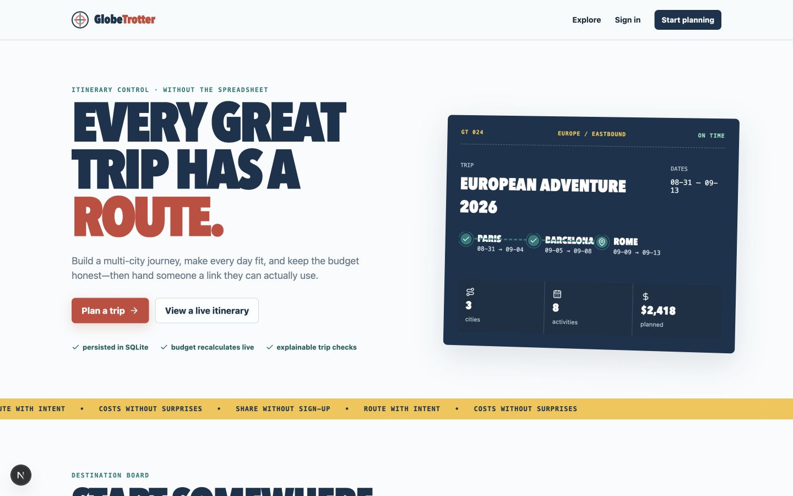
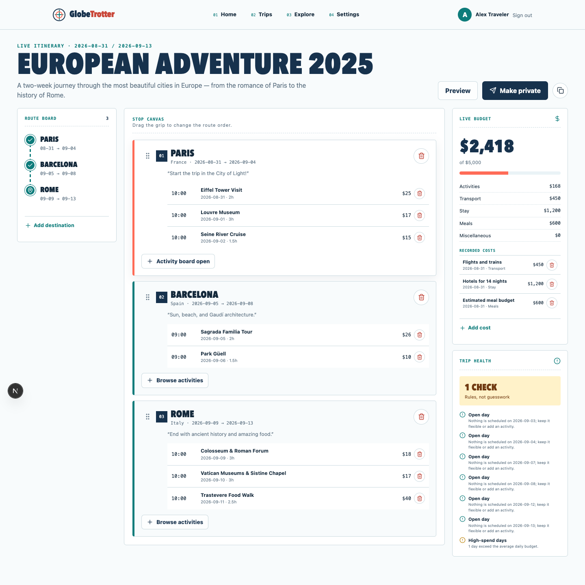
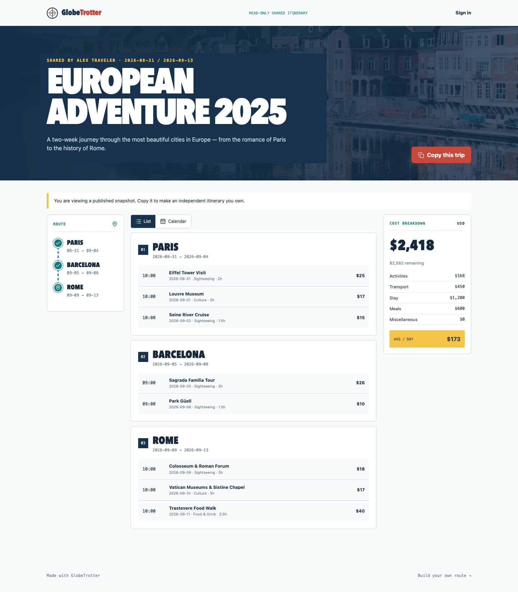
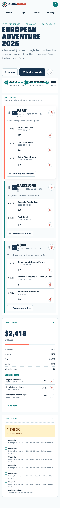
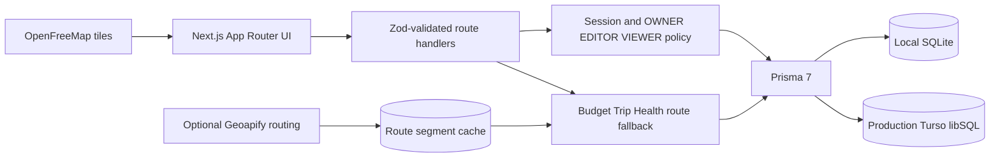
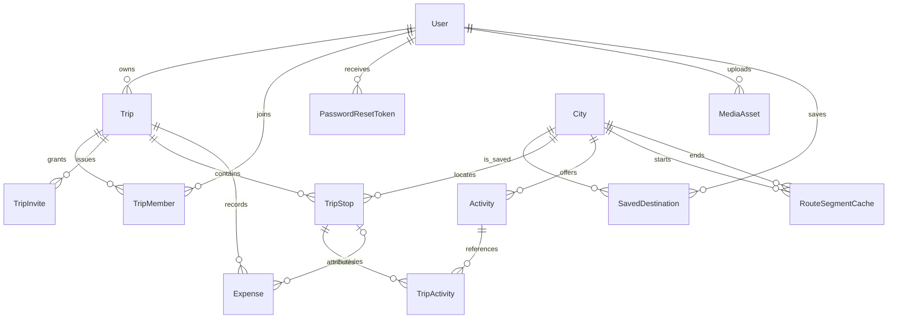

# GlobeTrotter

GlobeTrotter is a relational, map-led travel workspace built for the Odoo x LDCE Hackathon 2026. It turns a multi-city idea into a dated itinerary with live costs, explainable planning checks, role-based collaboration, and a public trip that another traveler can copy into an independent plan.

The product’s visual language is an editorial transit atlas: ticket codes, route ribbons, field-note typography, real destination imagery, restrained motion, and data-dense planning controls. It is designed to remain fully demonstrable without paid services or API keys.

## Judge-ready demonstration

- Production: `https://globetrotter-vert-ten.vercel.app`
- App: `http://localhost:3000`
- Traveler: `demo@globetrotter.com` / `password123`
- Collaborator: `admin@globetrotter.com` / `admin123`
- European itinerary: `http://localhost:3000/share/demo-europe-trip`
- Western India itinerary: `http://localhost:3000/share/demo-western-india`

> Costs are labelled USD estimates. GlobeTrotter does not claim live prices, booking inventory, or currency conversion.

## Product evidence

| Landing and personalized dashboard | Live route planner |
|---|---|
|  |  |

| Published Western India itinerary | Mobile planner |
|---|---|
|  |  |

## What is implemented

- Credentials sign-up/sign-in, one-click demo access, generic-response password recovery, hashed one-use recovery tokens, and password updates.
- Dashboard with recent owned/shared routes, incomplete-plan warnings, saved ideas, budget status, and database-backed recommendations.
- Trip creation and metadata editing, seeded cover gallery, validated JPEG/PNG/WebP cover and avatar uploads, privacy, dates, notes, and budget.
- 55 destination dossiers with editorial facts, coordinates, cost/season/stay context, real POIs, activity imagery, filters, saving, and add-to-trip actions.
- 390 distinct, city-specific activities. The clean-data gate rejects blank activity imagery, duplicate activity names, missing destination facts, or missing seeded demonstrations.
- MapLibre maps on destination, planner, review, and public surfaces using keyless OpenFreeMap tiles. Routes use cached Geoapify results when configured and persisted-coordinate geodesic fallbacks otherwise.
- Stop and activity scheduling, exact reordering, quick editing, arrival mode/context, expenses, list/calendar/map review, and refresh-persistent mutations.
- Recharts category donut and daily-spend charts with remaining budget, category totals, average per day, and over-budget markers.
- Explainable Trip Health for gaps, overlaps, open days, out-of-range schedules, and budget overruns.
- Owner/editor/viewer collaboration through hashed seven-day invite links and server-side access checks on every nested mutation.
- Stable public URLs, native sharing, copy link, WhatsApp, email, print, and transactional deep-copy.
- Saved destinations, profile/default privacy, image upload, password/account controls, and persistent English/Hindi/Gujarati primary navigation preferences.
- Responsive `Plan`, `Map`, and `Budget` modes, keyboard stop/activity ordering controls, visible focus, image fallbacks, and reduced-motion support.

## Quick start

Prerequisites: Node.js 24 and npm.

```bash
git clone https://github.com/Abhichandani-Yash-Manish/GlobeTrotter.git
cd GlobeTrotter
nvm use
cp .env.example .env
npm ci
npm run db:migrate
npm run db:seed
npm run dev
```

Open `http://localhost:3000`.

For a deliberate local reset, `npm run reset-demo` recreates the SQLite demo database. It permanently removes that local database’s current data and must never be pointed at production.

## Vercel deployment

The production application keeps the SQLite data model but uses Turso/libSQL so writes survive Vercel's serverless instances. Local development continues to use the repository's `file:` database.

```bash
vercel link
vercel integration add tursocloud/database
vercel env pull .env.local
npm run db:bootstrap:turso
```

`db:bootstrap:turso` applies the committed migrations and demo seed only when the remote database has no `User` table. On an initialized database it performs a read-only content check and refuses to reset data. Add `AUTH_SECRET` and `AUTH_TRUST_HOST=true` to the Production, Preview, and Development environments before deploying.

## Verification

```bash
npm run check
```

The gate performs all of the following:

1. regenerate Prisma Client;
2. run ESLint with zero warnings;
3. run the domain, validation, access, token-state, reorder, and geospatial tests;
4. produce an optimized Next.js build;
5. create a separate temporary SQLite database, apply every migration, seed it, audit its content, and remove only that temporary database.

The current seed-quality expectation is 55 cities, at least 300 distinct activities, no blank activity imagery, complete destination facts, and both public demo journeys.

## Architecture



- Server Components perform authenticated reads; focused Client Components own interaction and optimistic display state.
- APIs use one `ApiResult<T>` envelope and turn malformed JSON or Zod failures into safe field-level responses.
- `Trip.userId` remains the owner. `TripMember` grants editor or viewer access; `TripInvite` stores only a one-way token hash.
- Every trip-child mutation validates both the caller’s access and the child’s membership in the requested parent.
- Media is decoded with Sharp, orientation-normalized, resized inside 1800×1200, metadata-stripped, converted to WebP, and limited to 2 MB.
- Geoapify is optional and server-only. Unsupported modes, timeouts, quota failures, and malformed responses fall back to an explicitly labelled geodesic estimate.
- Public reads return a sanitized author and trip view; private trip media is readable only by its owner or members.

## Relational model



Derived totals are computed, not duplicated:

```text
spent = scheduled activity costs + transport/stay/meal/miscellaneous expenses
remaining = budget - spent
average per day = spent / inclusive trip days
```

## Key routes

| Route | Purpose |
|---|---|
| `/dashboard` | recent owned/shared work, warnings, saved ideas, recommendations |
| `/trips`, `/trips/new` | searchable archive and trip creation |
| `/trips/[id]/edit` | route, map, schedule, activities, costs, health, crew |
| `/trips/[id]` | list/calendar/map review and owner publishing |
| `/explore`, `/explore/[slug]` | destination search and editorial dossiers |
| `/share/[publicId]` | sanitized public itinerary, social actions, independent copy |
| `/invites/[token]` | authenticated role-aware invitation acceptance |
| `/forgot-password`, `/reset-password` | privacy-preserving account recovery |
| `/settings` | profile, uploads, preferences, saved places, account controls |

## Optional services and offline behavior

- `GEOAPIFY_API_KEY`: enables server-side road/walk/bike/transit routing and 30-day route caching. It is never sent to the client.
- `EMAIL_PROVIDER=console`: the default local adapter prints recovery URLs to the terminal. A deployment can replace the adapter without changing the recovery domain flow.
- OpenFreeMap requires no project key. If map tiles fail, route ribbons and textual stop/segment equivalents remain visible.
- Seeded city/activity content and images are committed as reviewed data records; the seed never calls an external enrichment API.

## Security decisions

- Passwords use bcrypt; reset and invite secrets are random, hashed, expiring, and one-use/revocable.
- Forgot-password returns the same response for known and unknown email addresses.
- Owner, editor, and viewer policy is enforced server-side; hidden buttons are only a usability layer.
- Reorder bodies must contain exactly the expected unique IDs.
- Uploaded MIME declarations are not trusted: Sharp must decode supported image contents before persistence.
- Destructive trip/account actions require explicit confirmation.
- Secrets, SQLite files, and generated media bytes are excluded from source control.

## Deliberate scope

The optional admin dashboard, live booking, currency conversion, real-time cursors/chat, and travel-document vault are excluded. SQLite remains the authoritative local judged environment because it offers migrations, constraints, indexes, transactions, and a repeatable offline demo. Production uses Turso's libSQL-compatible hosted SQLite so the same relational model remains durable on Vercel.

`npm audit` currently traces three high advisories to one `deepmerge-ts` recursive-object advisory in Prisma’s CLI/configuration dependency chain. npm proposes a breaking Prisma 6 downgrade; the project retains its tested Prisma 7.9.1 adapter setup and documents the advisory for production re-evaluation.

## Team delivery

Use focused branches and pull requests; do not share GitHub identities or push unreviewed work straight to `main`. See [CONTRIBUTING.md](CONTRIBUTING.md), [the specification audit](docs/SPECIFICATION_AUDIT.md), and [the demonstration runbook](docs/DEMO_RUNBOOK.md).
