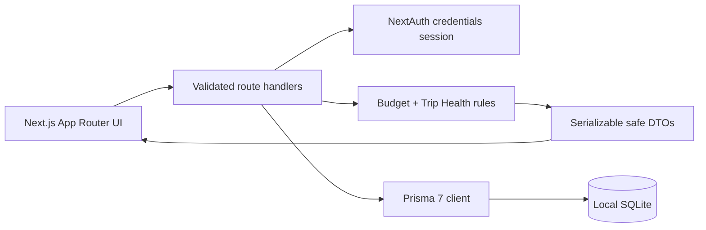
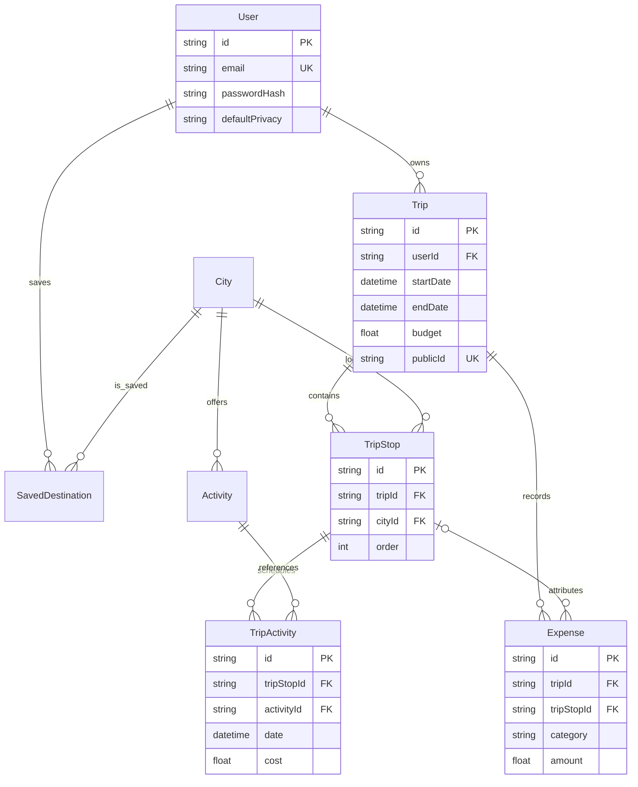

# GlobeTrotter

GlobeTrotter is a database-backed multi-city travel planner built for the Odoo x LDCE Hackathon 2026. A judge can sign in, create a trip, add dated destinations and activities, watch the budget and schedule checks update, publish the itinerary, and copy a shared trip into an independent plan.

The visual language combines an airport transit board with a personal field notebook. The signature route ribbon carries schedule health through the planner instead of hiding problems behind generic alerts.

## Demo

- App: `http://localhost:3000`
- Email: `demo@globetrotter.com`
- Password: `password123`
- Public seeded trip: `http://localhost:3000/share/demo-europe-trip`

> Costs are USD estimates. GlobeTrotter does not claim live booking inventory or currency conversion.

## Product snapshots

| Landing and judge journey | Live route planner |
|---|---|
|  |  |

| Public shared itinerary | Mobile planner |
|---|---|
|  |  |

## Quick start

Prerequisites: Node.js 24 and npm.

```bash
git clone https://github.com/Abhichandani-Yash-Manish/GlobeTrotter.git
cd GlobeTrotter
nvm use
cp .env.example .env
npm ci
npm run reset-demo
npm run dev
```

`npm run reset-demo` is intentionally destructive: it recreates the local demo database and seeds 50 cities, 202 activities, demo users, and sample trips. It does not affect any remote service.

For a normal schema update without erasing local data, run `npm run db:migrate`.

## Verification

```bash
npm run check
```

The gate regenerates Prisma Client, runs ESLint with zero warnings, executes the domain/validation/security-rule tests, and produces an optimized Next.js build. CI additionally creates a fresh SQLite database, applies the committed migration, and seeds it before the gate.

### Known dependency advisory

As reviewed on 22 August 2026, `npm audit` reports three high-severity package entries that all trace to one [`deepmerge-ts` recursive-object stack-exhaustion advisory](https://github.com/advisories/GHSA-ggr8-5vv4-36mx) through Prisma's CLI/configuration dependency chain. npm's suggested automatic fix is a breaking downgrade from Prisma 7.9.1 to Prisma 6.12.0. GlobeTrotter therefore retains its tested Prisma 7 SQLite-adapter setup, passes only repository-controlled configuration into that toolchain, and records the advisory here for re-evaluation before production deployment.

## The judged journey

1. Credentials or one-click demo sign-in.
2. Create a named trip with inclusive dates, privacy, notes, and a budget.
3. Search SQLite-backed destinations and add non-overlapping dated stops.
4. Drag stops into route order and browse activities belonging to each city.
5. Schedule activities and add transport, stay, meal, or miscellaneous costs.
6. Review the itinerary in list or calendar mode while the live budget and Trip Health update.
7. Publish a stable public URL and open the sanitized itinerary without authentication.
8. Sign in and deep-copy the public trip in a single database transaction.

No final screen relies on hard-coded JSON. The seed is data setup; pages and filters query SQLite and every planner mutation persists.

## Architecture



- Server Components perform authenticated page reads and send serializable DTOs to focused Client Components.
- Route handlers parse malformed JSON safely, validate with Zod, and return one `ApiResult<T>` envelope.
- Every child mutation verifies both ownership and parent membership. Reorder requests must contain exactly the owned IDs once.
- The public read model excludes email, role, user ID, and all password data.
- Publishing keeps a stable `publicId`; unpublishing immediately closes public access.
- Shared-copy creation duplicates the trip, stops, scheduled activities, and costs in one transaction.

## Relational model



Indexes cover owner lookup, public IDs, stop/activity/expense date access, city search fields, and saved-destination uniqueness. Derived budget totals are computed, never duplicated in storage.

## Trip Health is explainable

GlobeTrotter deliberately uses deterministic rules instead of a gratuitous chatbot. It identifies:

- stops outside the trip or overlapping another stop;
- uncovered dates before, between, or after stops;
- activities outside their stop or overlapping by clock time;
- destination days with no scheduled activity;
- total budget overruns and days above the average daily allowance.

Each issue explains the exact city/date involved, so a teammate can trace the result to code and data.

## Main routes and APIs

| Surface | Purpose |
|---|---|
| `/dashboard`, `/trips`, `/trips/new` | persisted trip overview and creation |
| `/trips/[id]/edit` | route, schedule, cost, and health workspace |
| `/trips/[id]` | list/calendar itinerary review and publishing |
| `/explore` | database filters, activity previews, saved cities |
| `/share/[publicId]` | public sanitized view and authenticated deep copy |
| `/settings` | profile, privacy, password, and account controls |

The API mirrors these resources under `/api/trips`, nested stops/activities/expenses, `/api/cities`, `/api/saved-destinations`, `/api/public/trips`, and `/api/users/profile`.

## Security and validation

- Emails are trimmed and lowercased; passwords are bcrypt-hashed.
- Dates, finite positive costs, categories, URLs, duplicate IDs, and JSON bodies are validated.
- Guessed trip, stop, scheduled-activity, and expense IDs cannot cross ownership boundaries.
- Trip and account deletion require an explicit confirmation value.
- Remote image loss falls back to a readable branded tile.
- `.env` and SQLite database files are ignored by Git.

## Deliberate trade-offs

- SQLite is the judged local relational database: zero service setup, inspectable migrations, real joins/constraints/indexes, and reliable offline demos.
- Seeded estimates replace booking APIs, whose credentials, quotas, and network failure would weaken an eight-hour prototype.
- Optional admin, uploads, live conversion, password recovery, and full localization are excluded from the core score-first journey.
- Google-hosted fonts are not used, so installation and builds remain network-independent after dependencies are present.

## Team workflow

Core implementation lives on `codex/globetrotter-core`; `main` receives reviewed pull requests only. See [CONTRIBUTING.md](CONTRIBUTING.md), [the team checklist](docs/TEAM_CHECKLIST.md), and [the three-minute runbook](docs/DEMO_RUNBOOK.md).

Do not invent contribution evidence. Each teammate edits, tests, commits, reviews, and presents their own bounded change under their own GitHub account.
